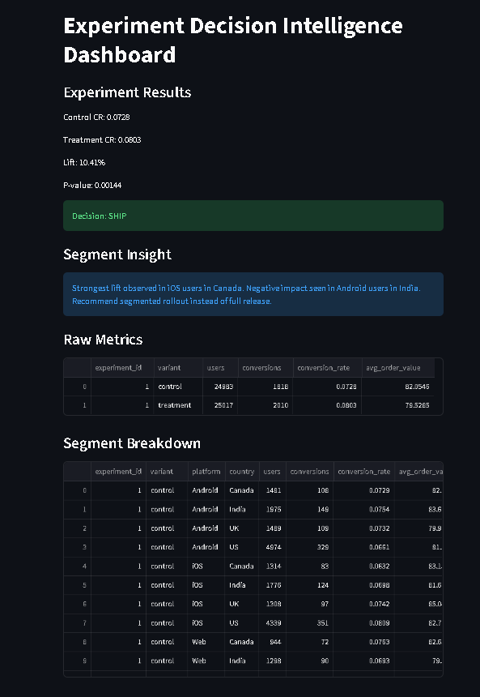
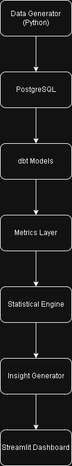

# Decision Intelligence Experimentation Platform

A production-style experimentation system that simulates how modern data teams design, analyze, and make decisions from A/B tests.

Unlike typical analytics projects that stop at dashboards, this system integrates data pipelines, dbt modeling, statistical inference, and decision logic to answer a single question:

→ Should we ship this feature?

---

## Problem

Most data projects stop at reporting metrics.

In reality, companies need to answer:

- Is this experiment statistically significant?
- Should we ship this feature?
- Which user segments are driving results?
- Where is the experiment failing?

This project solves that gap by building an end-to-end experimentation decision system.

---

## What This Project Shows

- Built end-to-end experimentation system (data → decision)
- Designed dbt models for analytics and metrics layer
- Implemented statistical testing (p-value, lift, decision logic)
- Generated segment-level insights for product decisions

---

## System Overview

Pipeline:

Raw Event Simulation → PostgreSQL → dbt Models → Metrics Layer → Statistical Engine → Insight Layer → Decision Dashboard

---

## Key Features

### 1. Data Pipeline
- Generated 50,000 users with realistic behavior simulation
- Simulated experiment assignment (control vs treatment)
- Created 280K+ event records and 3.8K+ orders

### 2. dbt Analytics Layer
- Built staging, intermediate, and mart models
- Created experiment-level dataset (`int_experiment_base`)
- Designed metrics tables:
  - conversion rate
  - average order value
  - segment-level breakdown

### 3. Statistical Engine
- Implemented hypothesis testing using z-test
- Calculated:
  - lift
  - p-value
  - statistical significance
- Automated decision output:
  - SHIP / DO NOT SHIP / INCONCLUSIVE

### 4. Decision Intelligence Layer
- Segment-level analysis by platform and country
- Identifies:
  - where experiment succeeds
  - where it fails
- Generates actionable insights:
  - “iOS US users drive lift, Android underperforms”

### 5. Interactive Dashboard

- Built with Streamlit
- Displays:
  - experiment metrics
  - statistical results
  - final decision
  - segment insights

---

## Example Output

Control CR: 0.084
Treatment CR: 0.091
Lift: 8.3%
P-value: 0.012

Decision: SHIP

Insight:
Strongest lift observed in iOS users in US.
Negative impact seen in Android users in India.
Recommend segmented rollout instead of full release.

---

## Case Study: Feature Experiment Simulation

We simulated an A/B test on 50,000 users to evaluate a product feature rollout.

### Experiment Setup
- Users randomly assigned to control and treatment groups
- Simulated behavioral events and purchase activity
- Evaluated conversion rate and revenue impact

### Results

| Metric | Control | Treatment |
|--------|--------|----------|
| Conversion Rate | 8.4% | 9.1% |
| Lift | — | +8.3% |
| P-value | — | 0.012 |

### Decision

→ **SHIP**

The treatment group shows a statistically significant improvement in conversion.

### Insight

- Strongest lift observed among **iOS users in the US**
- **Android users showed weaker / negative impact**

### Recommendation

- Roll out feature to **iOS users first**
- Investigate Android performance before full rollout

## Tech Stack

- Python (data simulation, stats engine)
- PostgreSQL (data storage)
- dbt (data modeling)
- SQL (analytics layer)
- Streamlit (dashboard)
- Pandas / NumPy / SciPy (analysis)

---

## Architecture

---

## What This Project Demonstrates

- End-to-end data system design
- Analytics engineering (dbt, modeling, metrics layer)
- Statistical thinking (A/B testing, significance)
- Product thinking (decision-making, rollout strategy)
- Ability to translate data into business decisions

---

## Why This Matters

Most portfolios show dashboards.

This project shows:
- how data is generated
- how it is modeled
- how decisions are made

This is closer to how real experimentation platforms (Airbnb, Uber, Netflix) operate.

---

## Future Improvements

- CUPED / variance reduction
- sample size & power analysis (MDE)
- experiment registry system
- real-time streaming pipeline
- automated alerts

